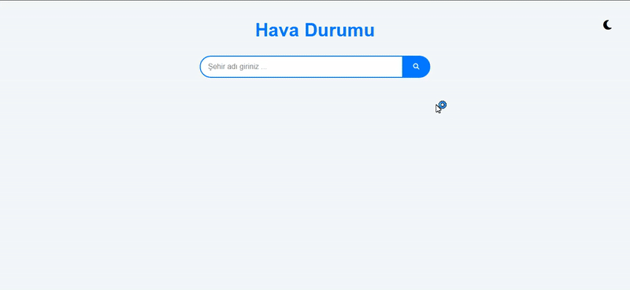

# 🌤️ Weather App

The Weather App allows users to search for a city and view its current weather conditions. It is a responsive, modern, and dynamic web application built using HTML5, SCSS, and modular JavaScript (ES6+).

---

## ⚙️ Features

✅ **City Search & Datalist**
Users can search for a city by name, with an autocomplete datalist for faster selection.

✅ **Dynamic Weather Card**
Displays temperature, “feels like” temperature, wind speed, humidity, pressure, and weather icons based on API data.

✅ **Light & Dark Theme Support**
Users can toggle between light and dark themes. Preferences are saved in LocalStorage.

✅ **Error Handling**
Displays informative error messages for invalid city searches.

✅ **Loading Animation**
Shows a loader while fetching data from the APIs.

✅ **Responsive Design**
Optimized for desktop, tablet, and mobile devices.

---

## 🛠 Technologies Used

- **HTML5** 🌐  
- **SCSS** 🎨  
- **JavaScript (ES6+)** ⚙️  
- **JSON 📦 (for city list and data management)** 📦
  
---
## 🔗 APIs Used

-OpenWeatherMap API 🌍
Provides current weather data including temperature, “feels like” temperature, wind speed, humidity, pressure, and weather icons.

-FlagCDN API 🏳️
Fetches country flag images based on country codes.
Example: SE fetches the Swedish flag image.

---

## 🔍 Preview

---

## 📞 Contact  

📩 **Email:** [saadetnajaf@gmail.com](mailto:saadetnajaf@gmail.com)  
📷 **Instagram:** [@saadet_najaf](https://www.instagram.com/saadet_najaf)  
💼 **LinkedIn:** [Saadet Najaf](https://www.linkedin.com/in/saadetnajaf/)  
